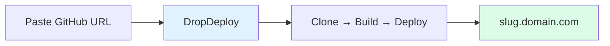
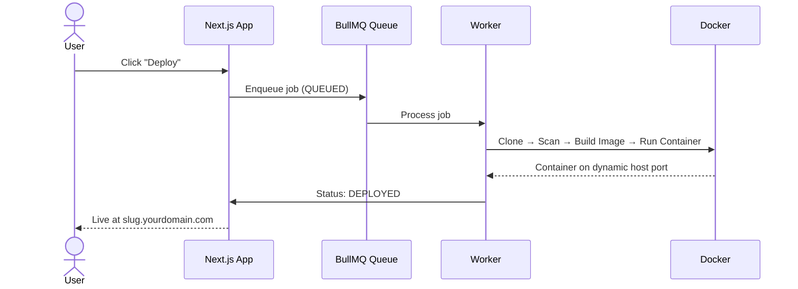

# DropDeploy

Deploy projects instantly by **pasting a GitHub repository URL**. The system clones, builds, containerizes, and hosts your project — returning a live subdomain URL.



---

## Features

- **GitHub deployment** — Deploy from any public repository URL
- **9 supported frameworks** — Static (HTML), Node.js, Next.js, React, Vue, Svelte, Django, FastAPI, Flask
- **Containerized builds** — Each deployment runs in an isolated Docker container with per-type resource limits
- **Live URLs** — Subdomain per project (`https://{slug}.yourdomain.com`)
- **In-app reverse proxy** — Database-driven routing, no per-project Nginx config or reloads required
- **Branch switching** — Choose which branch to deploy, switch between deploys
- **Build log streaming** — Real-time SSE log stream during builds; full log stored per deployment
- **Package security scanning** — Blocks known-malicious npm/pip packages before the build starts
- **Environment variables** — AES-256-GCM encrypted per-project env vars with per-environment overrides
- **Deployment cancellation & retry** — Cancel queued or retry failed deployments
- **Interactive terminal** — Run commands inside deployed containers with slash commands
- **Admin panel** — CONTRIBUTOR role with user management, project oversight, and force-deploy
- **Audit logs** — Immutable trail of env var and project actions per user
- **Authentication** — Email/password with JWT sessions (httpOnly cookie, HS256)
- **Worker health monitoring** — Redis heartbeat from the BullMQ worker process

---

## Tech Stack

| Layer | Technologies |
|-------|-------------|
| **Frontend** | Next.js 16 (App Router), React, shadcn/ui, Tailwind CSS |
| **Backend** | Next.js API Routes, Prisma ORM, PostgreSQL, Redis, BullMQ |
| **Infrastructure** | Docker (dockerode), Nginx (reverse proxy), simple-git |
| **Security** | AES-256-GCM encryption, bcrypt, jose (JWT), rate limiting, package blocklist |

---

## Prerequisites

- **Node.js** 22+
- **PostgreSQL** (local or remote)
- **Redis** (for BullMQ job queue)
- **Docker** daemon running

---

## Getting Started

### 1. Clone and install

```bash
git clone <repository-url>
cd dropDeploy
npm install
```

### 2. Environment variables

```bash
cp .env.example .env
```

Edit `.env` and configure:

| Variable | Description |
|----------|-------------|
| `DATABASE_URL` | PostgreSQL connection string |
| `JWT_SECRET` | Secret for JWT signing (32+ chars recommended) |
| `ENV_ENCRYPTION_KEY` | 64-char hex string for AES-256-GCM env var encryption |
| `BASE_DOMAIN` | Root domain for deployed project subdomains |
| `NEXT_PUBLIC_BASE_DOMAIN` | Same as `BASE_DOMAIN` — exposed to the client |
| `REDIS_HOST` / `REDIS_PORT` | Redis connection (defaults: `localhost`, `6379`) |

Generate the encryption key:
```bash
node -e "console.log(require('crypto').randomBytes(32).toString('hex'))"
```

See [.env.example](.env.example) for all options.

### 3. Database setup

```bash
# Create DB (if it doesn't exist)
createdb dropdeploy

# If your DB user needs schema permissions:
psql -d dropdeploy -f scripts/fix-db-permissions.sql

# Apply schema and generate client
npx prisma generate
npx prisma db push
```

### 4. Seed the admin account (optional)

```bash
CONTRIBUTOR_EMAIL=admin@example.com \
CONTRIBUTOR_PASSWORD=strongpassword \
npx tsx scripts/seed-contributor.ts
```

### 5. Run the app

**Development** (two terminals):

```bash
npm run dev      # Terminal 1: Next.js dev server (http://localhost:3001)
npm run worker   # Terminal 2: BullMQ deployment worker
```

Open [http://localhost:3001](http://localhost:3001). Sign up to access the dashboard.

**Production:**

```bash
npm run build && npm start
```

---

## How It Works



1. **Create project** — Provide a name, GitHub URL, and framework type.
2. **Deploy** — Click "Deploy" to queue a build job.
3. **Worker builds** — The BullMQ worker clones the repo, scans packages, builds a Docker image, and starts a container.
4. **Live URL** — Access your app at `https://{slug}.yourdomain.com`. Routing is handled by the in-app reverse proxy — no Nginx config files are written per project.

---

## Scripts

| Script | Description |
|--------|-------------|
| `npm run dev` | Start Next.js dev server (port 3001) |
| `npm run build` | Production build |
| `npm start` | Start production server |
| `npm run type-check` | Run TypeScript check (reliable build verification) |
| `npm run lint` | Run ESLint |
| `npm run test` | Run Jest tests |
| `npm run db:generate` | Generate Prisma client |
| `npm run db:push` | Push schema to DB (no migrations) |
| `npm run db:migrate` | Run Prisma migrations |
| `npm run db:studio` | Open Prisma Studio |
| `npm run worker` | Start deployment queue worker |

> **Note:** `npm run build` may fail with Turbopack + ssh2/dockerode ESM incompatibility. Use `npm run type-check` for reliable verification. The app runs fine in production via `npm start`.

---

## Project Structure

```
dropDeploy/
├── src/
│   ├── app/              # Next.js App Router
│   │   ├── (auth)/       # Login/register pages
│   │   ├── (dashboard)/  # Protected dashboard + project pages
│   │   └── api/          # API routes (auth, projects, admin, proxy, health)
│   ├── components/       # UI primitives (shadcn), features, layouts
│   ├── hooks/            # Custom React hooks
│   ├── lib/              # Utils, Prisma, Redis, queue, auth, config, logger
│   ├── repositories/     # Data access (User, Project, Deployment, EnvVar, AuditLog)
│   ├── services/         # Business logic (auth, project, deployment, docker, git, nginx, env-var, encryption, admin)
│   ├── types/            # TypeScript types & DTOs
│   ├── validators/       # Zod schemas
│   └── workers/          # BullMQ deployment worker
├── prisma/               # Database schema
├── docker/               # Nginx configs, Dockerfile templates
├── scripts/              # Dev setup, DB permissions, contributor seed
└── docs/                 # Documentation
```

For a detailed breakdown, see [docs/ARCHITECTURE.md](docs/ARCHITECTURE.md).

---

## Environment Variables

| Variable | Required | Default | Description |
|----------|----------|---------|-------------|
| `DATABASE_URL` | Yes | — | PostgreSQL connection string |
| `JWT_SECRET` | Yes* | — | Secret for JWT signing (32+ chars); optional in dev |
| `JWT_EXPIRES_IN` | No | `7d` | Token expiry |
| `ENV_ENCRYPTION_KEY` | Yes | — | 64-char hex string (32 bytes) for AES-256-GCM |
| `BASE_DOMAIN` | Yes | — | Base domain for deployment subdomain URLs |
| `NEXT_PUBLIC_BASE_DOMAIN` | Yes | — | Same as `BASE_DOMAIN`, exposed to client |
| `REDIS_HOST` | No | `localhost` | Redis host |
| `REDIS_PORT` | No | `6379` | Redis port |
| `NEXT_PUBLIC_APP_URL` | No | — | Public app URL for links |
| `DOCKER_SOCKET` | No | `/var/run/docker.sock` | Docker socket path |
| `NGINX_CONFIG_PATH` | No | `/etc/nginx/sites-enabled` | Nginx config path (production) |
| `PROJECTS_DIR` | No | `~/.dropdeploy/projects` | Cloned repo storage |
| `DOCKER_DATA_DIR` | No | `~/.dropdeploy/docker` | Docker data storage |
| `BULLMQ_CONCURRENCY` | No | `5` | Worker concurrency (1–20) |
| `BULLMQ_JOB_TIMEOUT_MS` | No | `900000` | Per-job timeout in ms (15 min) |
| `CONTRIBUTOR_EMAIL` | No | — | Default contributor account email (seeding) |
| `CONTRIBUTOR_PASSWORD` | No | — | Default contributor password (seeding) |
| `BLOCKED_PACKAGES` | No | — | Comma-separated extra blocked package names |
| `LOG_LEVEL` | No | `info` | Winston log level |

---

## Supported Frameworks

| Type | Base Image | Internal Port | Notes |
|------|-----------|--------------|-------|
| `STATIC` | `nginx:alpine` | 80 | Serves static files via Nginx |
| `NODEJS` | `node:22-alpine` | 3000 | `npm install --omit=dev` + `npm start` |
| `NEXTJS` | `node:22-alpine` | 3000 | Multi-stage build; `NEXT_PUBLIC_*` injected as build args |
| `REACT` | `node:22-alpine` → `nginx:alpine` | 80 | Vite/CRA build, static serving |
| `VUE` | `node:22-alpine` → `nginx:alpine` | 80 | Vite build, static serving |
| `SVELTE` | `node:22-alpine` → `nginx:alpine` | 80 | Vite/SvelteKit build |
| `DJANGO` | `python:3.13-slim` | 8000 | `pip install -r requirements.txt` + `manage.py runserver` |
| `FASTAPI` | `python:3.13-slim` | 8000 | `pip install -r requirements.txt` + `uvicorn main:app` |
| `FLASK` | `python:3.13-slim` | 5000 | `pip install -r requirements.txt` + `gunicorn app:app` |

---

## Documentation

| Document | Description |
|----------|-------------|
| [docs/PRD.md](docs/PRD.md) | Product requirements, user stories, and functional specs |
| [docs/ARCHITECTURE.md](docs/ARCHITECTURE.md) | Layered architecture, folder structure, and conventions |
| [docs/HOW-IT-WORKS.md](docs/HOW-IT-WORKS.md) | End-to-end system behavior with deployment pipeline details |
| [docs/subdomain-routing.md](docs/subdomain-routing.md) | Deep dive into in-app reverse proxy and subdomain routing |
| [docs/deployment.md](docs/deployment.md) | Production VPS deployment guide |
| [docs/TODO.md](docs/TODO.md) | Improvement roadmap organized by priority |
| [docs/learn.md](docs/learn.md) | Step-by-step codebase learning guide (~4-5 hours) |

---

## License

Private / unlicensed unless otherwise specified.
