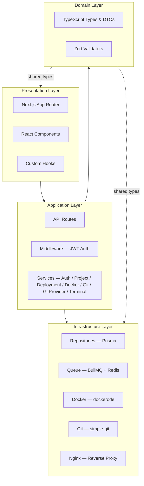
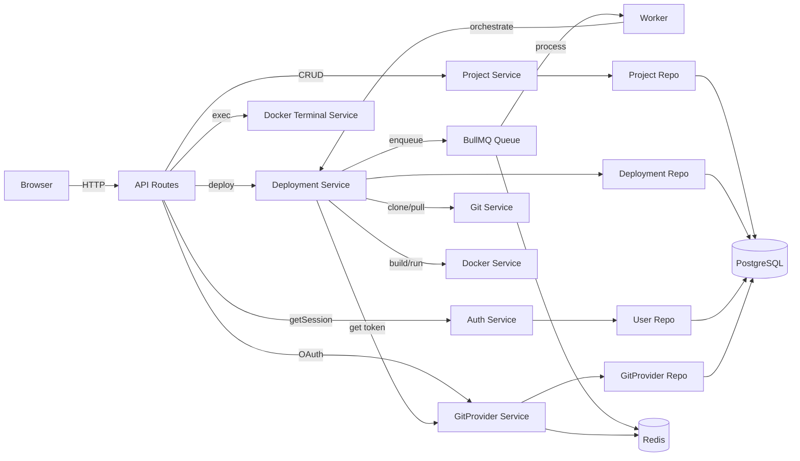
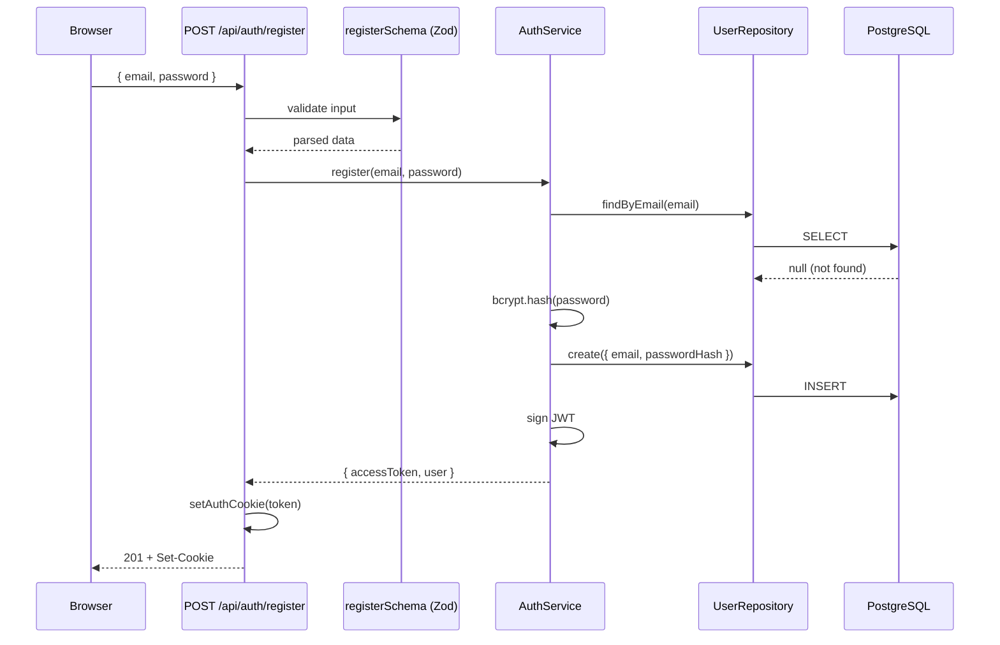
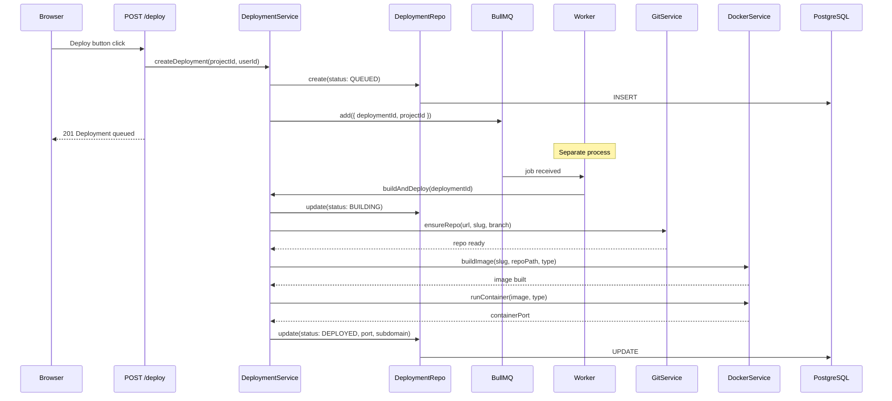
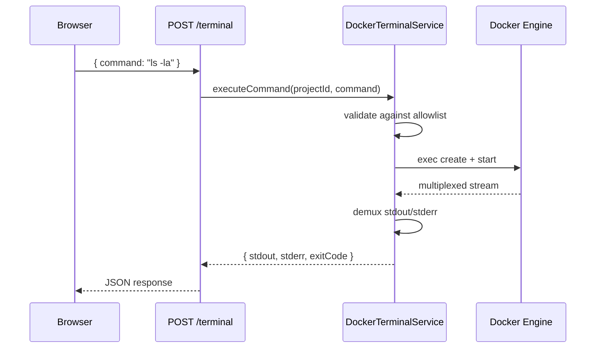

# Architecture & Folder Structure

> Scalable 4-layer architecture aligned with the [PRD](./PRD.md).
> For end-to-end runtime behavior, see [HOW-IT-WORKS.md](./HOW-IT-WORKS.md).

---

## 1. High-Level Architecture



| Layer | Responsibility | Key Rule |
|-------|---------------|----------|
| **Presentation** | Pages, components, hooks | No business logic — only renders data and dispatches actions |
| **Application** | API handlers + services | Orchestrates domain logic; validates input via Zod |
| **Domain** | Types, DTOs, validators | Pure definitions — no I/O, no side effects |
| **Infrastructure** | DB, queue, Docker, Git | All external I/O lives here; accessed only through interfaces |

---

## 2. Component Interaction



---

## 3. Folder Structure

```
dropDeploy/
├── src/
│   ├── app/                           # Next.js App Router
│   │   ├── (auth)/                    # Auth route group
│   │   │   ├── login/page.tsx
│   │   │   ├── register/page.tsx
│   │   │   └── layout.tsx
│   │   ├── (dashboard)/               # Protected routes
│   │   │   ├── dashboard/
│   │   │   │   ├── page.tsx
│   │   │   │   └── admin/             # Contributor-only admin panel
│   │   │   │       ├── layout.tsx     # Tab bar (Overview / Projects / Users / Analytics)
│   │   │   │       ├── page.tsx       # Admin overview
│   │   │   │       ├── projects/page.tsx
│   │   │   │       ├── users/page.tsx
│   │   │   │       └── analytics/page.tsx  # Platform-wide analytics dashboard
│   │   │   ├── projects/[id]/page.tsx # Project detail (Overview / Analytics / Publish / Settings / Advanced tabs)
│   │   │   └── layout.tsx
│   │   ├── explore/
│   │   │   ├── page.tsx               # Public showcase listing
│   │   │   └── [slug]/page.tsx        # Per-project showcase with JSON-LD + generateMetadata
│   │   ├── docs/
│   │   │   ├── getting-started/page.tsx   # Getting-started guide
│   │   │   ├── git-setup/page.tsx         # Git connection setup
│   │   │   ├── local-dev/page.tsx         # Run builds locally
│   │   │   ├── frameworks/[slug]/page.tsx # Per-framework documentation
│   │   │   ├── claude-code/               # Claude Code /deploy command guide
│   │   │   ├── layout.tsx                 # Sidebar layout
│   │   │   └── page.tsx                   # Docs index
│   │   ├── api/
│   │   │   ├── auth/                  # login, logout, register, session
│   │   │   │   ├── token/route.ts         # POST — CLI login (returns JWT in body, not cookie)
│   │   │   │   ├── github/
│   │   │   │   │   ├── connect/route.ts   # Start GitHub OAuth flow
│   │   │   │   │   └── callback/route.ts  # GitHub OAuth callback
│   │   │   │   └── gitlab/
│   │   │   │       ├── connect/route.ts   # Start GitLab OAuth flow
│   │   │   │       └── callback/route.ts  # GitLab OAuth callback
│   │   │   ├── git-providers/
│   │   │   │   ├── route.ts               # GET — list connected providers
│   │   │   │   └── [provider]/
│   │   │   │       ├── route.ts           # DELETE — disconnect provider
│   │   │   │       └── repos/route.ts     # GET — search repos (Redis-cached)
│   │   │   ├── projects/
│   │   │   │   ├── route.ts           # GET (list) / POST (create)
│   │   │   │   └── [id]/
│   │   │   │       ├── route.ts       # GET / PATCH / DELETE
│   │   │   │       ├── deploy/route.ts
│   │   │   │       ├── terminal/route.ts
│   │   │   │       ├── analytics/route.ts   # Traffic metrics (hits, device breakdown)
│   │   │   │       └── showcase/route.ts    # GET / POST showcase config
│   │   │   ├── analytics/
│   │   │   │   └── event/route.ts     # POST — fire-and-forget platform event
│   │   │   ├── proxy/
│   │   │   │   └── [slug]/[[...path]]/route.ts  # Reverse proxy: serves static files from disk (STATIC_FILES) or forwards to container (CONTAINER) + ProxyHit recording
│   │   │   ├── admin/
│   │   │   │   ├── users/             # CRUD + role + password reset (contributor only)
│   │   │   │   ├── projects/          # Admin project management (contributor only)
│   │   │   │   └── analytics/route.ts # Platform-wide analytics (contributor only)
│   │   │   └── health/route.ts
│   │   ├── sitemap.ts                 # Dynamic XML sitemap (Next.js built-in)
│   │   ├── robots.ts                  # robots.txt (Next.js built-in)
│   │   ├── globals.css
│   │   ├── layout.tsx
│   │   └── page.tsx                   # Landing page
│   │
│   ├── components/
│   │   ├── ui/                        # Reusable primitives (Button, Card, ...)
│   │   ├── features/                  # Feature components
│   │   │   ├── auth-header.tsx
│   │   │   ├── create-project-form.tsx  # Repo picker + sessionStorage draft restore
│   │   │   ├── dashboard-nav.tsx
│   │   │   ├── git-provider-panel.tsx   # Connect/disconnect GitHub & GitLab cards
│   │   │   ├── project-list.tsx         # Auto-polling project grid
│   │   │   ├── project-tile.tsx         # Status badge + deploy button
│   │   │   ├── repo-picker.tsx          # Debounced search modal for private repos
│   │   │   └── terminal.tsx             # Interactive container terminal
│   │   └── layouts/
│   │
│   ├── hooks/
│   │   ├── use-fetch-mutation.ts      # Generic API mutation hook
│   │   ├── use-terminal.ts            # Terminal state + command execution
│   │   └── index.ts
│   │
│   ├── lib/                           # Shared utilities & infra clients
│   │   ├── api-error.ts               # Centralized error → HTTP response
│   │   ├── auth-cookie.ts             # httpOnly cookie management
│   │   ├── config.ts                  # Zod-validated env (PROJECTS_DIR, DOCKER_DATA_DIR, STATIC_SERVE_DIR, ...)
│   │   ├── errors.ts                  # AppError hierarchy
│   │   ├── get-session.ts             # JWT → { userId } extraction
│   │   ├── local-ip.ts               # WebRTC-based local IP detection
│   │   ├── prisma.ts                  # Singleton Prisma client
│   │   ├── queue.ts                   # IDeploymentQueue interface + BullMQ impl
│   │   ├── redis.ts                   # ioredis connection factory
│   │   └── utils.ts                   # cn(), slugify(), sleep()
│   │
│   ├── repositories/                  # Data access layer
│   │   ├── user.repository.ts         # IUserRepository + implementation
│   │   ├── project.repository.ts      # IProjectRepository + slug uniqueness
│   │   ├── deployment.repository.ts   # IDeploymentRepository + subdomain transfer
│   │   ├── git-provider.repository.ts # IGitProviderRepository — findByUserAndProvider, upsert, delete
│   │   ├── showcase.repository.ts     # IShowcaseRepository — findBySlug, upsert, incrementViewCount; exposes user.handle (email prefix), never user.email
│   │   └── index.ts
│   │
│   ├── services/                      # Business logic
│   │   ├── auth/                      # Register, login, JWT signing/verify
│   │   ├── project/                   # CRUD with ownership checks
│   │   ├── deployment/                # Orchestrates the full build pipeline
│   │   ├── docker/
│   │   │   ├── docker.service.ts      # Build image + run container
│   │   │   ├── docker-terminal.service.ts  # Exec commands in containers
│   │   │   ├── dockerfile.templates.ts     # Per-type Dockerfile strings
│   │   │   ├── nextjs-config-patcher.ts    # ESM/CJS config patching
│   │   │   └── index.ts
│   │   ├── git/
│   │   │   ├── git.service.ts         # Clone-once + branch switching + token scrub
│   │   │   └── index.ts
│   │   └── git-provider/
│   │       ├── git-provider.service.ts  # OAuth connect/disconnect, token fetch + auto-refresh
│   │       └── index.ts
│   │
│   ├── types/                         # Domain types & DTOs
│   │   ├── api.types.ts               # ApiResponse<T>, PaginatedResponse
│   │   ├── deployment.types.ts        # DeploymentStatus, DeploymentJob
│   │   ├── project.types.ts           # ProjectType, CreateProjectDto
│   │   └── index.ts
│   │
│   ├── validators/                    # Zod schemas
│   │   ├── auth.validator.ts          # registerSchema, loginSchema
│   │   ├── project.validator.ts       # createProjectSchema, updateProjectSchema
│   │   └── index.ts
│   │
│   └── workers/
│       └── deployment.worker.ts       # BullMQ worker (concurrency: 5)
│
├── prisma/
│   └── schema.prisma                  # User, Project, Deployment, GitProvider, ProjectShowcase, ProxyHit, PlatformEvent models
├── docker/
│   ├── templates/                     # Dockerfile templates per project type
│   └── nginx/                         # Reverse-proxy config
├── plugin/                            # dropdeploy-cli npm package
│   ├── src/
│   │   ├── cli.ts                     # Entry point — commands: deploy, projects, auth, help
│   │   ├── api.ts                     # API client — listProjects, triggerDeploy, streamLogs, detectType
│   │   ├── auth.ts                    # Credential storage (JSON file) + login via /api/auth/token
│   │   └── detector.ts                # Local git info (remote URL, branch, dirty check) + framework hint
│   ├── package.json                   # Published as dropdeploy-cli on npm (binary: dropdeploy)
│   └── README.md
├── public/
│   └── deploy.md                      # Markdown rendered by the Claude Code /deploy command download page
├── scripts/
│   └── setup-dev.sh
└── docs/
    ├── PRD.md                         # Product requirements
    ├── ARCHITECTURE.md                # This file
    ├── HOW-IT-WORKS.md                # End-to-end runtime behavior
    ├── TODO.md                        # Improvement roadmap
    └── learn.md                       # Codebase learning guide
```

---

## 4. Key Conventions

| Concern | Convention |
|---------|-----------|
| **HTTP handling** | API routes parse body → validate with Zod → call service → return JSON |
| **Error handling** | Custom `AppError` hierarchy (`lib/errors.ts`) caught by `handleApiError()` (`lib/api-error.ts`) |
| **DB access** | Only through repositories — no Prisma imports in API routes or components |
| **Queue** | `IDeploymentQueue` interface in `lib/queue.ts`; BullMQ implementation behind it |
| **Static hosting** | STATIC / REACT / VUE / SVELTE types use `servingMethod: STATIC_FILES` — files extracted to `STATIC_SERVE_DIR/<slug>/` after build; no persistent container. Dynamic types use `servingMethod: CONTAINER`. |
| **Auth** | JWT (HS256 via `jose`) stored in httpOnly `auth-token` cookie |
| **Session** | `getSession(req)` extracts `{ userId }` from JWT; every protected route calls it |
| **Config** | Centralized Zod-validated env in `lib/config.ts` via `getConfig()` |
| **DI pattern** | Services take dependencies via constructor; export both the class and a wired singleton |
| **Repo pattern** | Each repository defines an interface (e.g., `IUserRepository`) in the same file as its implementation |
| **Authorization** | Services check `resource.userId === session.userId`; return 404 (not 403) to hide existence |
| **Admin protection** | `requireContributor(session)` in any admin API route; contributor role stored on User |
| **Fire-and-forget writes** | Analytics writes (ProxyHit, PlatformEvent) use `.catch(() => {})` so they never block responses |
| **SEO** | `sitemap.ts` and `robots.ts` use Next.js built-in conventions (no extra package); JSON-LD injected via `dangerouslySetInnerHTML` with `<` escaped to `<` |

---

## 5. Data Flow Examples

### Authentication (register)



### Deployment (trigger → live URL)



### Terminal command



---

## 6. Scaling the Codebase

| Adding... | Where to put it |
|-----------|----------------|
| New feature service | `services/<feature>/` with constructor DI |
| New database entity | `prisma/schema.prisma` + `repositories/<entity>.repository.ts` |
| New API endpoint | `app/api/<resource>/route.ts` |
| New UI feature | `components/features/<feature>.tsx` |
| New React hook | `hooks/use-<feature>.ts` |
| New background job | `workers/<job>.worker.ts` + queue in `lib/queue.ts` |
| New config variable | Add to Zod schema in `lib/config.ts` |

---

## 7. PRD Mapping

| PRD Section | Implementation |
|-------------|----------------|
| 5.1 Auth | `AuthService`, JWT, `UserRepository`, `/api/auth/*` |
| 5.2 Projects | `ProjectService`, `ProjectRepository`, `GitService` |
| 5.2 Git Providers | `GitProviderService`, `GitProviderRepository`, `/api/auth/github/*`, `/api/auth/gitlab/*`, `/api/git-providers/*` |
| 5.3 Type Detection | `ProjectType` enum, `DOCKERFILE_TEMPLATES` in `services/docker/`, `detector.ts` in CLI |
| 5.4 Build & Deploy | `DeploymentService`, `DockerService`, `GitService`, `deployment.worker.ts` |
| 5.4a CLI Access | `plugin/` package (`dropdeploy-cli`), `/api/auth/token`, `DropDeployApi`, credential file |
| 5.5 Status | `DeploymentStatus` enum, `buildStep` tracking (CLONING / BUILDING_IMAGE / STARTING) |
| 5.6 URLs | Subdomain routing via Nginx, `BASE_DOMAIN` in config |
| 5.7 Branches | `project.branch` field, `GitService.ensureRepo()` with branch switching |
| 5.8 Terminal | `DockerTerminalService`, `/api/projects/:id/terminal`, slash commands |
