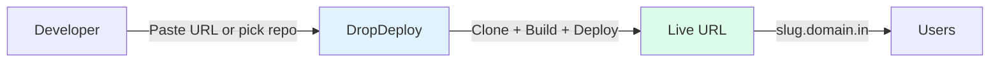
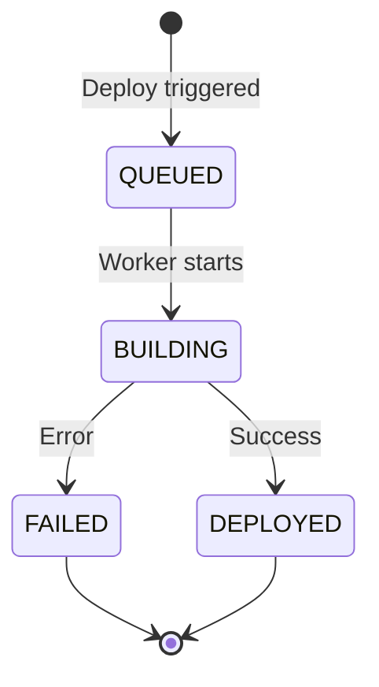
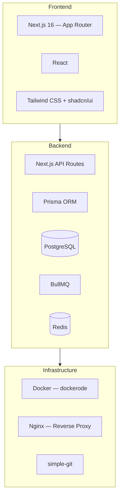

# Product Requirements Document (PRD)

**Product:** DropDeploy

---

## 1. Objective

Build a web platform that allows users to **deploy projects instantly** by pasting a GitHub or GitLab repository URL, or by selecting a repository from a connected account (including private repos). The system automatically builds, deploys, and hosts the project, returning a **publicly accessible URL**.

---

## 2. Goals & Non-Goals

### Goals (MVP)

- GitHub and GitLab repo deployment via URL
- Private repository support via OAuth (GitHub + GitLab)
- Searchable repo picker for connected accounts
- Automatic project type detection (Static, Node.js, Next.js, React, Vue, Svelte, Django, FastAPI, Flask)
- Containerized build and runtime (Docker)
- Live deployment URL via subdomain
- Build status tracking with step-by-step progress
- Configurable deploy branch per project
- Interactive terminal for deployed containers
- Local network access URLs
- Secure execution environment
- CLI tool (`dropdeploy-cli`) for terminal and CI/CD deployments
- In-app documentation with per-framework guides

### Non-Goals (Out of Scope)

- Custom domains
- Billing & subscriptions
- Autoscaling
- Secrets management UI
- Multi-region hosting

---

## 3. Target Users

| Audience | Use Case |
|----------|----------|
| **Frontend developers** | Quick deploy for prototypes and side projects |
| **Students & learners** | Deploy class projects and learning exercises |
| **Hackathon participants** | Rapid deployment during time-constrained events |
| **Internal/QA teams** | Preview builds for review and testing |

---

## 4. User Stories

### US-1: Deploy GitHub Repo
As a user, I want to paste a GitHub repository URL and deploy it automatically.

### US-2: Track Deployment
As a user, I want to see build progress with step-by-step indicators (cloning, building, starting) in real time.

### US-3: Access Deployed App
As a user, I want a stable URL to access my deployed project, plus a local network URL for testing on other devices.

### US-4: Choose Deploy Branch
As a user, I want to select which git branch to deploy and switch branches between deploys.

### US-5: Container Terminal
As a user, I want to run commands inside my deployed container to debug issues, view logs, and inspect the environment.

### US-6: Deploy Private Repositories
As a user, I want to connect my GitHub or GitLab account and deploy private repositories without exposing credentials.

### US-7: Browse and Select Repositories
As a user with a connected Git account, I want to search and pick a repository from a list instead of pasting a URL manually.

### US-8: CLI Deployment
As a developer, I want to trigger a deployment from my terminal using `dropdeploy deploy` so I can deploy without opening the browser, and stream build output in real time.

### US-9: CI/CD Deployment
As an automation user, I want to deploy using environment variables (`DROPDEPLOY_TOKEN`, `DROPDEPLOY_URL`) so I can integrate DropDeploy into GitHub Actions or other CI pipelines.

---

## 5. Functional Requirements

### 5.1 Authentication

- Email & password authentication (MVP)
- JWT-based sessions stored in httpOnly cookies
- Session validation and logout endpoints
- One user can manage multiple projects

### 5.2 Project Creation

**GitHub / GitLab Mode:**
- Public and private repositories supported
- Clone via HTTPS (with OAuth token for private repos)
- Configurable deploy branch (default: `main`)
- Source (`GITHUB` / `GITLAB`) auto-detected from repo URL
- Repo picker: searchable modal populated from connected account (debounced search, Redis-cached)
- Manual URL input always available as fallback

**Git Provider Connection:**
- One-click OAuth connect for GitHub and GitLab
- Tokens stored AES-256-GCM encrypted per user per provider
- GitLab tokens auto-refreshed (2h expiry); GitHub tokens are non-expiring
- CSRF-safe: one-time-use nonce stored in Redis (10min TTL)
- Disconnect via Settings → Git Connections

**Upload Mode** (future):
- Drag & drop folder upload (client-side zip)
- Max upload size: 100 MB
- Basic structure validation

### 5.3 Project Type Detection

Detection runs server-side (via `POST /api/projects/detect-type`) and client-side in the CLI. The repo picker triggers detection automatically when a repo is selected.

| Detected Signal | Project Type |
|----------------|-------------|
| `next.config.js` / `.ts` / `.mjs` | Next.js |
| `vite.config.*` + React dep | React (Vite) |
| `vite.config.*` + Vue dep | Vue |
| `vite.config.*` + Svelte dep | Svelte |
| `package.json` (Node.js, no framework) | Node.js |
| `manage.py` + `requirements.txt` | Django |
| `main.py` with `FastAPI()` | FastAPI |
| `app.py` with `Flask()` | Flask |
| `index.html` (no package.json) | Static Site |
| `go.mod` | Go |
| `Cargo.toml` | Rust |
| `pom.xml` | Java / Spring Boot |

### 5.4a CLI Access

`dropdeploy-cli` is an npm package (`npm install -g dropdeploy-cli`) that exposes a `dropdeploy` binary.

**Commands:**

| Command | Description |
|---------|-------------|
| `dropdeploy auth login` | Interactive login — stores JWT locally |
| `dropdeploy auth status` | Show current login |
| `dropdeploy auth logout` | Clear stored credentials |
| `dropdeploy deploy` | Trigger deploy, auto-match project by git remote, stream live build log |
| `dropdeploy projects` | List all projects and their latest status |
| `dropdeploy help` | Command reference |

**Flags for `deploy`:**

| Flag | Description |
|------|-------------|
| `--project-id <id\|slug>` | Skip auto-match; deploy to a named project |
| `--dir <path>` | Use a different local directory |

**CI/CD environment variables (skip interactive login):**

| Variable | Purpose |
|----------|---------|
| `DROPDEPLOY_TOKEN` | Bearer JWT (replaces `auth login`) |
| `DROPDEPLOY_URL` | API base URL |
| `DROPDEPLOY_EMAIL` | Email (cosmetic, shown in logs) |

**Backend endpoint:** `POST /api/auth/token` — returns the JWT in the response body (instead of a cookie) for CLI consumption.

### 5.4 Build & Deployment

- Dockerfile generated dynamically based on project type
- Clone-once strategy: repos persist locally for faster rebuilds
- Branch switching supported between deploys
- **Static types (STATIC, REACT, VUE, SVELTE):** Docker builds the image, files are extracted from `/usr/share/nginx/html` into `STATIC_SERVE_DIR/<slug>/`, then the container and image are destroyed. The in-app proxy serves files directly from disk. RAM per project: ~0 MB. Cold start: instant.
- **Dynamic types (NODEJS, NEXTJS, DJANGO, FASTAPI, FLASK, GO, RUST, JAVA):** Build image → run persistent container → assign random host port (4000–9999). Map project slug to subdomain.

### 5.5 Deployment Status

**Build steps:** `CLONING` → `BUILDING_IMAGE` → `STARTING`

**Timing:** `startedAt` (worker begins) and `completedAt` (success or failure)

**Logs:** Build & error logs persisted in the deployment record.

### 5.6 URL Management

- Auto-generated subdomain: `https://{slug}.domain.in`
- Nginx routes subdomain traffic to the correct container port
- Local network URL: `http://<local-ip>:<port>` for same-network access

### 5.7 Branch Management

- Each project stores a configurable `branch` field (default: `main`)
- Branch can be changed in project settings
- Redeploying after a branch change checks out the new branch
- Git service handles shallow/unshallow conversion for branch discovery

### 5.8 Interactive Terminal

- Execute shell commands inside deployed containers
- Built-in slash commands: `/show-logs`, `/tail-logs`, `/env`, `/files`, `/help`
- Command allowlist for safety
- 30-second timeout per command
- Terminal UI with command history, autocomplete, and resizable output

---

## 6. Non-Functional Requirements

### Performance

- Deployment start time < 10 seconds
- Static site deployment < 30 seconds
- Subsequent deploys faster due to persistent repo clones

### Security

- Docker sandboxing with resource limits (512 MB memory, CPU shares)
- Non-root containers
- Terminal command allowlist; user commands exec'd directly (no shell) — metacharacters blocked
- No host filesystem access from containers
- Email PII never leaves the repository layer — `ShowcaseWithProject` exposes `user.handle` (email prefix) only

### Reliability

- Build failures must not impact other deployments
- Retry-safe deployment jobs (3 retries, exponential backoff)
- Graceful degradation when Redis is unavailable

---

## 7. Tech Stack

| Layer | Technologies |
|-------|-------------|
| **Frontend** | Next.js 16 (App Router), React, Tailwind CSS, shadcn/ui |
| **Backend** | Next.js API Routes, Prisma ORM, PostgreSQL, BullMQ + Redis |
| **Infrastructure** | Docker (dockerode), Nginx, simple-git, single VPS (MVP) |
