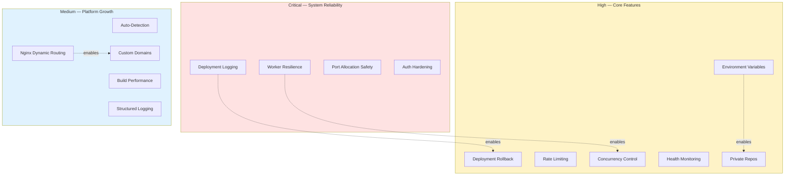

# Improvement Roadmap

> Actionable improvements organized by priority. Each item includes context on why it matters.

---

## Priority Overview

---

## Critical

### Deployment Logging & Observability

- [x] Store full Docker build logs in database (not just last error)
- [x] Capture stdout/stderr with timestamps during build (`buildLog` column)
- [x] Add log viewer UI on the project detail page per deployment
- [x] Show real-time build output (SSE stream via `GET /api/projects/:id/deployments/:dId/logs/stream`)

### Worker Resilience

- [x] Mark stuck `BUILDING` deployments as `FAILED` on worker restart (`recoverStuckDeployments()`)
- [x] Implement per-job timeout (`BULLMQ_JOB_TIMEOUT_MS`, default 15 min)
- [x] Add worker health heartbeat tracked in Redis (`worker:health` key, 90s TTL)
- [ ] Add dead-letter queue UI for manually retrying permanently failed jobs

### Port Allocation Safety

- [x] Check port availability before assigning (TCP probe + DB exclusion list)
- [x] Track allocated ports in database (`clearPortForOtherDeployments` on redeploy)
- [ ] Handle port conflicts gracefully instead of failing silently

### Auth Hardening

- [ ] Implement refresh token rotation (short-lived access + long-lived refresh)
- [ ] Add token revocation on logout (store revoked tokens in Redis with TTL)
- [ ] Verify `httpOnly`, `secure`, `sameSite=strict` flags are set consistently

---

## High

### Deployment Rollback

- [ ] Track `previousDeploymentId` on each deployment
- [ ] Add `POST /api/projects/:id/rollback/:deploymentId` endpoint
- [ ] Keep previous container available (tagged with version) until rollback window expires
- [ ] Add rollback button in project detail UI

### Environment Variables

- [x] Add `EnvironmentVariable` model (projectId, key, encryptedValue, iv, authTag)
- [x] Pass env vars to Docker container at runtime via `--env`; `NEXT_PUBLIC_*` injected as build args
- [x] Add env var editor UI in project settings
- [x] Mask values in UI and logs (values stored encrypted; masked in API responses)

> Implemented with AES-256-GCM encryption, per-environment overrides (ALL / DEVELOPMENT / STAGING / PRODUCTION), and audit logging.

### Rate Limiting & Resource Quotas

- [x] Per-route rate limiting via Redis (`lib/rate-limit.ts`, applied on env-var routes)
- [x] Per-project deployment lock (Redis advisory lock + smart queue prevents double-deploys)
- [ ] Per-user container limit (e.g., 5 running containers)
- [ ] Auto-cleanup of deployments older than 30 days

### Deployment Concurrency Control

- [x] Per-project deployment lock (Redis advisory lock in `createDeployment()`)
- [x] Queue new deploy requests while one is in progress (smart hold-back queue)
- [x] Cancel queued deployment if a newer one is triggered (supersede pattern)
- [x] Show "deployment in progress" indicator to prevent double-clicks (UI status badges)

### Container Health Monitoring

- [ ] Add health check to generated Dockerfiles
- [ ] Poll container health status and expose in UI
- [ ] Auto-restart crashed containers (Docker restart policy: `on-failure:3`)
- [ ] Alert user when container is unhealthy or stopped

### Private Repository Support

- [ ] GitHub OAuth token for private repo cloning
- [ ] SSH deploy key support per project
- [ ] Store credentials encrypted in database
- [ ] Credential management UI in project settings

---

## Medium

### Project Type Auto-Detection

- [ ] Parse `package.json` on clone to detect framework
- [ ] Auto-detect based on file presence (`index.html`, `manage.py`, etc.)
- [ ] Show detected type to user for confirmation before first deploy

### Build Performance

- [ ] Enable Docker BuildKit (`DOCKER_BUILDKIT=1`) for layer caching
- [ ] Cache `node_modules` and `pip` packages across builds via Docker volumes
- [x] Custom Dockerfile support (repo-root `Dockerfile` is detected and used automatically)

### Custom Domains

- [ ] Add `CustomDomain` model with DNS validation state
- [ ] CNAME verification endpoint
- [ ] Auto-provision SSL via Let's Encrypt (certbot)
- [ ] Generate Nginx config per custom domain
- [ ] Domain management UI with status indicators

### Nginx Dynamic Routing

- [x] All routing handled dynamically by in-app proxy (database-driven, no Nginx files per project)
- [ ] Support WebSocket proxying for real-time apps
- [ ] Add HTTPS redirect and HSTS headers

### Structured Logging

- [x] Winston logger with configurable log level (`LOG_LEVEL` env var)
- [x] Audit log table for user actions (`AuditLog` model: ENV_CREATED, ENV_UPDATED, ENV_DELETED, DEPLOY_TRIGGERED, PROJECT_SETTINGS_UPDATED, PROJECT_DELETED)
- [ ] Add request ID tracing across API → service → worker

### Database Resilience

- [x] Indexes on frequently queried fields (`project.userId`, `deployment.projectId`, `deployment.status`)
- [ ] Connection pooling (PgBouncer or Prisma pool settings)
- [ ] Query timeout configuration
- [ ] Automated daily backups

### Deployment History UI

- [x] Paginated deployment history per project (`GET /api/projects/:id/deployments`)
- [x] Show build duration, branch, commit hash per deployment
- [ ] Diff view between deployments
- [ ] "Redeploy" button on historical deployments

---

## Low

### Testing

- [x] Unit tests for package scanner (`src/__tests__/package-scanner.test.ts`)
- [ ] Unit tests for other services (auth, deployment, docker, git)
- [ ] Integration tests for API routes
- [ ] E2E test for full deploy flow (create → deploy → verify URL)
- [ ] CI pipeline (GitHub Actions) with test + type-check
- [ ] Test coverage tracking

### Team & Collaboration

- [ ] `Team` model with member roles (admin, developer, viewer)
- [ ] Project sharing with role-based permissions
- [ ] Deployment approval workflow for production projects
- [ ] Activity feed showing team actions

### Developer Experience

- [ ] `docker-compose.yml` for local dev (PostgreSQL + Redis)
- [ ] Pre-commit hooks (lint + type-check)
- [ ] `.devcontainer.json` for VS Code dev containers

### API & Integrations

- [ ] Webhook notifications for deployment events
- [ ] GitHub webhook for auto-deploy on push
- [ ] Slack/Discord notification integration

### UI Polish

- [ ] Onboarding wizard for first-time users
- [ ] Project analytics (uptime, deploy frequency, build time trends)
- [ ] Mobile responsiveness improvements
- [ ] Keyboard shortcuts (D = deploy, R = rollback, T = terminal)
- [ ] Global error boundary with retry
- [ ] Disallow spaces in env variable key input validation

### Performance

- [ ] Redis caching for project list and detail queries
- [ ] HTTP cache headers (ETag, Cache-Control) on API responses
- [ ] Lazy-load deployment history and terminal output

---

## Quick Wins

High impact, achievable in a single session:

| # | Item | What to do |
|---|------|-----------|
| 1 | **Docker BuildKit** | Set `DOCKER_BUILDKIT=1` in worker env for faster builds |
| 2 | **Container restart policy** | Add `RestartPolicy: { Name: 'on-failure', MaximumRetryCount: 3 }` |
| 3 | **Request ID tracing** | Add `x-request-id` header propagation across API → service → worker logs |
| 4 | **WebSocket proxying** | Forward `Upgrade` header in the in-app proxy for real-time apps |
| 5 | **Auto-cleanup** | Cron job or worker task to prune deployments older than 30 days |
| 6 | **Token revocation** | Store logout token JTI in Redis with TTL matching `JWT_EXPIRES_IN` |
