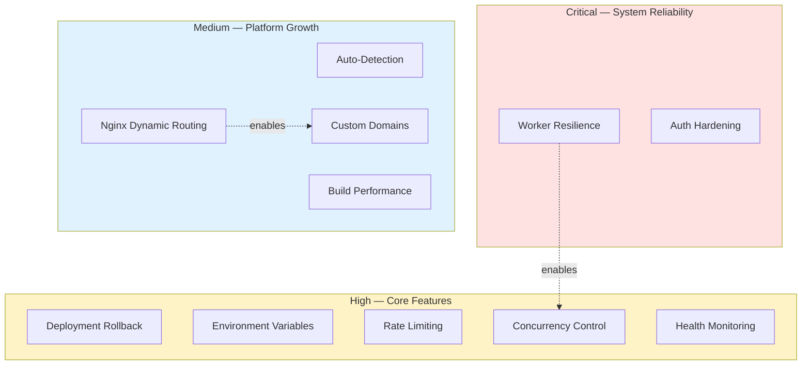

# Improvement Roadmap

> Actionable improvements organized by priority. Each item includes context on why it matters.

---

## Priority Overview

---

## Critical

### Worker Resilience

- [ ] Add dead-letter queue UI for manually retrying permanently failed jobs

> If the worker crashes mid-build, deployments stay in `BUILDING` forever.

### Auth Hardening

- [ ] Implement refresh token rotation (short-lived access + long-lived refresh)
- [ ] Add token revocation on logout (store revoked tokens in Redis with TTL)
- [ ] Verify `httpOnly`, `secure`, `sameSite=strict` flags are set consistently

### Documentation

- [x] Get started with project creation
- [x] Git setup in project
- [x] Run build locally
- [x] Category with framework docs

---

## High

### Deployment Rollback

- [ ] Track `previousDeploymentId` on each deployment
- [ ] Add `POST /api/projects/:id/rollback/:deploymentId` endpoint
- [ ] Keep previous container available (tagged with version) until rollback window expires
- [ ] Add rollback button in project detail UI

### Environment Variables

- [ ] Support `.env` file upload

### Rate Limiting & Resource Quotas

- [ ] Per-user deployment rate limit (e.g., 10/hour) via Redis
- [ ] Limit 1 active deployment per project (queue subsequent triggers)
- [ ] Per-user container limit (e.g., 5 running containers)
- [ ] Auto-cleanup of deployments older than 30 days

### Deployment Concurrency Control

- [ ] Cancel queued deployment UI — backend endpoint exists at `/api/projects/:id/deployments/:deploymentId/cancel`; cancel button not yet in UI

### Container Health Monitoring

- [ ] Add health check to generated Dockerfiles
- [ ] Poll container health status and expose in UI
- [ ] Alert user when container is unhealthy or stopped

---

## Medium

### Build Performance

- [ ] Enable Docker BuildKit (`DOCKER_BUILDKIT=1`) for layer caching
- [ ] Cache `node_modules` and `pip` packages across builds via Docker volumes
- [ ] Support custom Dockerfile (user-provided in repo root)

### Custom Domains

- [ ] Add `CustomDomain` model with DNS validation state
- [ ] CNAME verification endpoint
- [ ] Auto-provision SSL via Let's Encrypt (certbot)
- [ ] Generate Nginx config per custom domain
- [ ] Domain management UI with status indicators

### Database Resilience

- [ ] Connection pooling (PgBouncer or Prisma pool settings)
- [ ] Query timeout configuration
- [ ] Automated daily backups

### Deployment History UI

- [ ] Paginated deployment history per project
- [ ] Diff view between deployments

---

## Low

### Testing

- [ ] Unit tests for services (auth, deployment, docker, git)
- [ ] Integration tests for API routes
- [ ] E2E test for full deploy flow (create → deploy → verify URL)
- [ ] CI pipeline (GitHub Actions) with test + type-check
- [ ] Test coverage tracking

### Team & Collaboration

- [ ] `Team` model with member roles (admin, developer, viewer)
- [ ] Project sharing with role-based permissions
- [ ] Deployment approval workflow for production projects
- [ ] Activity feed showing team actions

### Developer Experience

- [ ] `docker-compose.yml` for local dev (PostgreSQL + Redis)
- [ ] Pre-commit hooks (lint + type-check)
- [ ] `.devcontainer.json` for VS Code dev containers

### API & Integrations

- [ ] Webhook notifications for deployment events
- [ ] GitHub webhook for auto-deploy on push
- [ ] Slack/Discord notification integration

### UI Polish

- [ ] Onboarding wizard for first-time users
- [ ] Mobile responsiveness improvements
- [ ] Global error boundary with retry

### Performance

- [ ] Redis caching for project list and detail queries
- [ ] HTTP cache headers (ETag, Cache-Control) on API responses
- [ ] Pagination on all list endpoints
- [ ] Lazy-load deployment history and terminal output

---

## Quick Wins

High impact, achievable in a single session:

| # | Item | What to do |
|---|------|-----------|
| 1 | **Docker BuildKit** | Set `DOCKER_BUILDKIT=1` in worker env for faster builds (currently stripping BuildKit directives for classic builder compat) |
| 2 | **Deployment cancel UI** | Add cancel button on QUEUED/BUILDING deployments — endpoint already exists |
