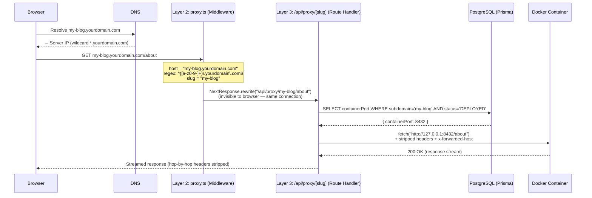
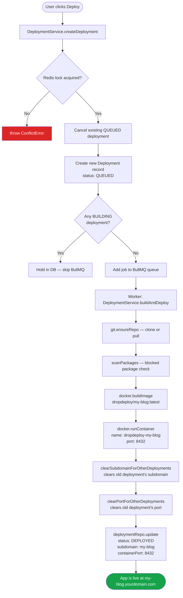
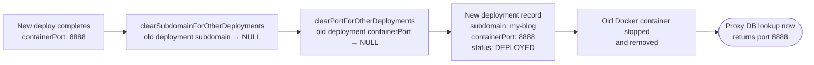

# Domain Routing — How It Works

## Overview

DropDeploy uses a **fully dynamic, in-app reverse proxy** — no Nginx config files are written per project, no server reloads are needed. Every subdomain request is resolved from the database at runtime, forwarded to the correct Docker container, and the response is streamed back to the browser transparently.

---

## For Non-Technical People

Think of it like a postal sorting office. When you create a project called "My Blog", the system gives it a permanent address label: `my-blog`. Once your project is built and running, anyone who visits:

```
https://my-blog.yourdomain.com
```

...is automatically sent to your app. You never configure anything. The platform handles the routing behind the scenes. If `my-blog` is already taken, your project gets `my-blog-1`, then `my-blog-2`, and so on.

---

## Architecture: The 4 Layers

```
┌─────────────────────────────────────────────────────────────────┐
│  Layer 1 · DNS / Network                                        │
│  Wildcard DNS: *.yourdomain.com → server IP                     │
└─────────────────────────────┬───────────────────────────────────┘
                              │ HTTP request arrives
┌─────────────────────────────▼───────────────────────────────────┐
│  Layer 2 · Proxy Middleware  (src/proxy.ts)                     │
│  Runs on EVERY request. Detects subdomain in Host header.       │
│  Rewrites: my-blog.domain.com/path → /api/proxy/my-blog/path   │
└─────────────────────────────┬───────────────────────────────────┘
                              │ internal rewrite (browser never sees it)
┌─────────────────────────────▼───────────────────────────────────┐
│  Layer 3 · In-App Reverse Proxy  (src/app/api/proxy/[slug]/…)  │
│  Looks up slug in DB → gets containerPort.                      │
│  Forwards request to http://127.0.0.1:{port}/path              │
└─────────────────────────────┬───────────────────────────────────┘
                              │ HTTP forward
┌─────────────────────────────▼───────────────────────────────────┐
│  Layer 4 · Docker Container                                     │
│  Your deployed app, listening on a dynamic host port (8000–9999)│
└─────────────────────────────────────────────────────────────────┘
```

---

## Full Request Flow Diagram



---

## Deployment Flow: How the Routing Record Gets Created



---

## Slug Generation Algorithm

**File:** `src/repositories/project.repository.ts:85`

```ts
// Input: project name from user
"My  Blog!!"
  → .toLowerCase()          → "my  blog!!"
  → .trim()                 → "my  blog!!"
  → .replace(/[^\w\s-]/g)   → "my  blog"     ← strips ! and special chars
  → .replace(/[\s_-]+/g,'-')→ "my-blog"      ← collapses spaces/underscores to -
  → .replace(/^-+|-+$/g)    → "my-blog"      ← strips leading/trailing dashes
```

**Uniqueness guarantee:** Loops against the DB until a free slug is found:

```
my-blog        → taken? → my-blog-1
my-blog-1      → taken? → my-blog-2
my-blog-2      → free   → assigned ✓
```

The slug is written to `Project.slug` at creation time and **never changes** — redeployments reuse the same slug.

---

## Port Assignment

**File:** `src/services/docker/docker.service.ts:276`

Container host ports are allocated dynamically from the range **8000–9999**:

1. A random offset within the range is chosen to reduce collisions between concurrent workers.
2. Each candidate port is probed with a TCP server (`net.createServer`) to verify it is free.
3. Active ports held by other `DEPLOYED` containers are fetched from the DB (`findActiveContainerPorts`) and excluded upfront.
4. If a port conflict still occurs on `container.start()`, the worker retries up to 3 times.

```
excludePorts = [8100, 8200, ...]   ← from DB (other live containers)
random start = 8547
probe 8547 → busy
probe 8548 → free ✓  → hostPort = 8548
```

Container resource limits per project type:

| Type    | Memory   | CPU Shares |
|---------|----------|------------|
| STATIC  | 128 MB   | 256        |
| REACT   | 128 MB   | 256        |
| VUE     | 128 MB   | 256        |
| SVELTE  | 128 MB   | 256        |
| FLASK   | 256 MB   | 512        |
| NODEJS  | 512 MB   | 1024       |
| DJANGO  | 512 MB   | 512        |
| FASTAPI | 512 MB   | 512        |
| NEXTJS  | 1024 MB  | 1024       |

---

## Deep Dive: The In-App Reverse Proxy

**File:** `src/app/api/proxy/[slug]/[[...path]]/route.ts`

---

### How It's Possible in Next.js

Next.js App Router allows **Route Handlers** — plain `async` functions that handle HTTP requests, equivalent to Express routes but running inside the Next.js server process. Three filename conventions make this proxy work:

**`[slug]` — dynamic segment**
```
/api/proxy/my-blog/about
              ↑
          slug = "my-blog"
```

**`[[...path]]` — optional catch-all segment**
```
/api/proxy/my-blog/about/page/1  →  path = ["about", "page", "1"]
/api/proxy/my-blog               →  path = []   ← double [[ ]] makes it optional
```

Single brackets `[...path]` require at least one segment. Double brackets `[[...path]]` make it optional so the root path `/` also works.

**`export const dynamic = 'force-dynamic'`**

Tells Next.js to never cache this route. Every request hits the handler fresh because the container port can change on redeployment.

**All HTTP methods exported**
```ts
export const GET = handler;
export const POST = handler;
// PUT, PATCH, DELETE, HEAD, OPTIONS ...
```
Next.js App Router only handles methods you explicitly export. Exporting all of them makes the proxy fully transparent — it forwards whatever method the browser sent.

---

### Step-by-Step Code Walkthrough

#### Step 1 — Extract slug and path

```ts
const { slug, path = [] } = await params;
```

`params` is a `Promise` in Next.js 16 (async params). `path` defaults to `[]` if the URL has no path beyond the slug.

#### Step 2 — Look up the container port from the database

```ts
const deployment = await prisma.deployment.findFirst({
  where: { subdomain: slug, status: 'DEPLOYED' },
  select: { containerPort: true },
});
```

This single DB query is the **entire routing table** — no config files, no in-memory maps. The DB is the single source of truth.

- `subdomain: slug` — finds the project matching the URL
- `status: 'DEPLOYED'` — only live deployments count; BUILDING/FAILED/QUEUED are ignored
- `select: { containerPort: true }` — fetches only the port, nothing else

If nothing found → `404`:
```ts
if (!deployment?.containerPort) {
  return NextResponse.json(
    { error: `No active deployment found for "${slug}"` },
    { status: 404 }
  );
}
```

#### Step 3 — Build the target URL

```ts
const targetPath = path.length > 0 ? `/${path.join('/')}` : '/';
const targetUrl = `http://127.0.0.1:${deployment.containerPort}${targetPath}${request.nextUrl.search}`;
```

Examples:
```
slug=my-blog, path=["about"],         search=""       → http://127.0.0.1:8432/about
slug=my-blog, path=[],                search=""       → http://127.0.0.1:8432/
slug=my-blog, path=["api","users"],   search="?page=2"→ http://127.0.0.1:8432/api/users?page=2
```

`127.0.0.1` (loopback) is used because the container runs on the **same host machine** — Docker maps a host port to the container's internal port.

#### Step 4 — Build forwarded headers

```ts
const forwardHeaders = new Headers();
for (const [key, value] of request.headers.entries()) {
  const k = key.toLowerCase();
  if (!HOP_BY_HOP.has(k) && k !== 'host' && k !== 'accept-encoding') {
    forwardHeaders.set(key, value);
  }
}
forwardHeaders.set('x-forwarded-host', request.headers.get('host') ?? '');
forwardHeaders.set('x-forwarded-proto', request.nextUrl.protocol.replace(':', ''));
```

Start with all browser headers, remove the dangerous ones (explained in detail below), then inject two metadata headers so the container knows it's behind a proxy.

#### Step 5 — Body forwarding (POST/PUT/PATCH)

```ts
const hasBody = !['GET', 'HEAD'].includes(request.method);

upstream = await fetch(targetUrl, {
  method: request.method,
  headers: forwardHeaders,
  body: hasBody ? request.body : undefined,
  ...(hasBody && ({ duplex: 'half' } as any)),
});
```

`request.body` is a **`ReadableStream`** — not a buffer. The body is streamed directly from the browser to the container without being fully loaded into memory first. Critical for large file uploads.

`duplex: 'half'` is a Node.js-specific requirement. Node.js fetch refuses to accept a streaming body unless you declare the stream is half-duplex (send body while simultaneously receiving a response). Without it, Node throws a runtime error.

#### Step 6 — Stream the response back

```ts
return new NextResponse(upstream.body, {
  status: upstream.status,
  statusText: upstream.statusText,
  headers: responseHeaders,
});
```

`upstream.body` is also a `ReadableStream`. Passing it directly to `NextResponse` means the response is **streamed byte-for-byte as it arrives** — the proxy never buffers the full response in memory. This is essential for large HTML pages, file downloads, Server-Sent Events (SSE), and streaming AI responses.

#### Step 7 — 502 on container unreachable

```ts
} catch {
  return NextResponse.json(
    { error: 'Failed to reach the deployed app. It may still be starting up.' },
    { status: 502 }
  );
}
```

`502 Bad Gateway` is the standard HTTP status when a proxy can't reach its upstream. This happens when the container crashed, Docker is still starting the container, or the port binding hasn't completed yet.

---

### What Are Hop-by-Hop Headers?

HTTP headers fall into two categories:

| Category | Meaning | Examples |
|----------|---------|---------|
| **End-to-end** | Intended for the final destination; must be forwarded | `content-type`, `authorization`, `cookie`, `accept` |
| **Hop-by-hop** | Only meaningful between two directly connected nodes; must be consumed and **never forwarded** | `connection`, `transfer-encoding`, `upgrade` |

The full hop-by-hop set defined by RFC 7230:

```
connection           — lists which headers are hop-by-hop for THIS connection
keep-alive           — connection persistence negotiation
proxy-authenticate   — proxy auth challenge
proxy-authorization  — proxy auth credentials
te                   — transfer encodings the client accepts
trailers             — trailer header names
transfer-encoding    — how the body is framed (chunked, gzip, etc.)
upgrade              — protocol upgrade request (e.g. WebSocket)
```

#### Why you MUST strip them — the `transfer-encoding` bug

```
WITHOUT stripping:

Browser → Proxy:     Transfer-Encoding: chunked   (body is chunked)
Proxy   → Container: Transfer-Encoding: chunked   ← forwarded
                     BUT: body is no longer chunked — Node.js already decoded it
Container:           tries to parse a non-existent chunk structure → hangs or fails ✗

WITH stripping (correct):

Browser → Proxy:     Transfer-Encoding: chunked
Proxy strips it
Proxy   → Container: (clean body, no framing header)
Container:           processes it correctly ✓
```

#### The three extra headers stripped beyond the RFC set

**`host`**
```
Browser sends:  Host: my-blog.yourdomain.com
Proxy strips it
Container sees: Host: 127.0.0.1:8432  (set by Node.js fetch)
```
If forwarded, the container would see a hostname it doesn't recognize and may reject or misroute the request.

**`accept-encoding`** — the subtlest one

This prevents a silent content corruption bug:

```
WITHOUT stripping:

Browser → Proxy:     Accept-Encoding: gzip, br
Proxy   → Container: Accept-Encoding: gzip, br   ← forwarded
Container → Proxy:   body=<gzip compressed>, Content-Encoding: gzip

Node.js fetch:       auto-decompresses gzip body ✓
                     BUT keeps Content-Encoding: gzip in headers ✗

Proxy → Browser:     Content-Encoding: gzip (header) + plain body (already decompressed)
Browser:             tries to decompress an already-decompressed body
Result:              "Content Encoding Error" 💥

WITH stripping:

Proxy strips accept-encoding before forwarding
Container → Proxy:   plain body, no Content-Encoding header
Proxy → Browser:     clean response ✓
```

---

### Header Handling Reference Tables

**On the forwarded request (browser → container):**

| Action   | Headers | Reason |
|----------|---------|--------|
| Stripped | `connection`, `keep-alive`, `proxy-authenticate`, `proxy-authorization`, `te`, `trailers`, `transfer-encoding`, `upgrade` | RFC 7230 hop-by-hop — must not cross proxy boundaries |
| Stripped | `host` | Replaced by the container's own host binding |
| Stripped | `accept-encoding` | Prevents stale `content-encoding` after Node.js auto-decompression |
| Added    | `x-forwarded-host` | Original `Host` header value so the app knows the public hostname |
| Added    | `x-forwarded-proto` | `http` or `https` so the app can generate correct absolute URLs |

**On the upstream response (container → browser):**

| Action   | Headers | Reason |
|----------|---------|--------|
| Stripped | Hop-by-hop set (same as above) | RFC 7230 |
| Stripped | `content-encoding` | Node.js fetch already decompressed the body; forwarding this tells browser to decompress again |
| Stripped | `content-length` | Byte count is now wrong after decompression; browser would truncate or hang waiting for bytes |

---

### Complete Mental Model

```
Browser request                  Proxy handler               Docker container
──────────────────────────────────────────────────────────────────────────────
GET /about HTTP/1.1
Host: my-blog.domain.com   ──►   slug = "my-blog"
Accept-Encoding: gzip            DB lookup → port 8432
Transfer-Encoding: chunked       strip HOP_BY_HOP             GET /about HTTP/1.1
Connection: keep-alive           strip host             ──►   x-forwarded-host: my-blog.domain.com
cookie: session=abc              strip accept-encoding         x-forwarded-proto: https
                                 keep cookie, auth, etc.       cookie: session=abc

                                                               200 OK
                                 ◄──  container response       content-type: text/html
                                      strip content-encoding   content-encoding: gzip  ← stripped
                                      strip content-length     content-length: 1234    ← stripped
◄──  200 OK
     content-type: text/html
     (body streamed, never buffered)
```

---

### Benefits of This Architecture

| Benefit | Detail |
|---------|--------|
| **Zero config routing** | No Nginx files, no reloads — routing is a single DB query per request |
| **Instant cutover on redeploy** | New deployment is live the moment the DB write completes |
| **Memory efficient** | Request and response bodies are streamed, never buffered |
| **Protocol correct** | RFC 7230 hop-by-hop stripping prevents proxy chain corruption |
| **All HTTP methods supported** | GET, POST, PUT, PATCH, DELETE, HEAD, OPTIONS — fully transparent |
| **Works with SPAs** | `[[...path]]` catch-all forwards all client-side routes to the container |
| **Query strings preserved** | `request.nextUrl.search` is appended verbatim |
| **Standard error codes** | 404 for missing deployment, 502 for unreachable container |

---

## Nginx Service — Development vs Production

**File:** `src/services/nginx/nginx.service.ts`

The `NginxService` exists in the codebase as a **production-only** fallback. It is **not used** for per-request routing — it is a no-op in development and test environments.

```ts
// nginx.service.ts:44
if (config.NODE_ENV !== 'production') {
  log.warn('Non-production environment — skipping nginx config', { slug });
  return;  // ← does nothing in dev/test
}
```

If it were active, it would write a config file like:

```nginx
server {
    listen 80;
    server_name my-blog.yourdomain.com;
    location / {
        proxy_pass http://127.0.0.1:8432;
        proxy_set_header Host $host;
        proxy_set_header X-Forwarded-For $proxy_add_x_forwarded_for;
    }
}
```

The current architecture deliberately **does not use this path** — the in-app proxy (`Layer 3`) handles all routing dynamically from the database instead.

---

## Redeploy Behaviour

When the same project is deployed again:



The subdomain never changes. The routing table (DB) is updated atomically. Zero-downtime is achieved because:
1. The new container is fully started before the DB record is updated.
2. The proxy reads the DB on every request — it picks up the new port immediately on the next request after the DB write.

---

## Key Design Properties

| Property | Detail |
|----------|--------|
| **No Nginx reload** | Routing is purely DB-driven; new deploys are live instantly |
| **Wildcard DNS** | One DNS record (`*.yourdomain.com → IP`) covers all projects |
| **Slug is immutable** | Set at project creation, reused across all redeployments |
| **One active subdomain per project** | `clearSubdomainForOtherDeployments` ensures uniqueness |
| **Port range** | `8000–9999` (2000 slots), dynamically probed via TCP |
| **Matcher runs on ALL paths** | Required so static assets (`/_next/static/…`) from deployed apps are also proxied correctly |
